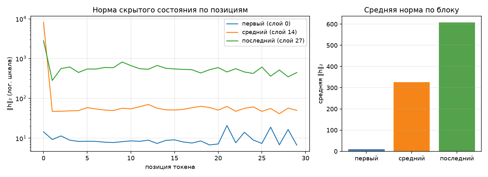

# Анатомия Qwen3-0.6B

Сгенерировано `make inspect`. dtype `bfloat16`, device `mps`.

## 1. Конфигурация

| Параметр | Значение |
|---|--:|
| слоёв | 28 |
| hidden_size | 1024 |
| intermediate_size | 3072 |
| голов запроса | 16 |
| KV-голов (GQA) | 8 |
| head_dim | 128 |
| словарь | 151 936 |
| tie_word_embeddings | True |

GQA: 16 голов запроса на 8 KV-головы — KV-cache вдвое меньше, чем при обычном multi-head.

## 2. Условия замера

| Условие | Значение |
|---|---|
| платформа | macOS-26.6.2-arm64-arm-64bit (Darwin 25.6.0, arm64) |
| устройство | `mps` |
| dtype | `bfloat16` |
| seq_len × batch | 256 × 1 |
| прогонов на режим | 1 |
| память измерена | `torch.mps.driver_allocated_memory` |
| RSS измерена | `ru_maxrss` |
| python | 3.12.4 |
| torch | 2.14.0 |
| transformers | 5.16.1 |
| peft | 0.20.0 |

Цифры ниже верны только для этих условий. Замер памяти без указания
устройства, dtype, длины последовательности и метрики не воспроизводится
и не сравнивается — поэтому источник метрики стоит отдельной строкой.
Сверьте, что в этой строке названа метрика, уместная для вашего
устройства, и что полученные числа с ней согласуются.

## 3. Параметры по типам модулей

| Группа | Модулей | Shape | Параметров | Доля | Разделяет тензор |
|---|--:|---|--:|--:|--:|
| `embed` | 1 | 151936×1024 | 155 582 464 | 26.10% | — |
| `q_proj` | 28 | 2048×1024 | 58 720 256 | 9.85% | — |
| `k_proj` | 28 | 1024×1024 | 29 360 128 | 4.93% | — |
| `v_proj` | 28 | 1024×1024 | 29 360 128 | 4.93% | — |
| `o_proj` | 28 | 1024×2048 | 58 720 256 | 9.85% | — |
| `gate_proj` | 28 | 3072×1024 | 88 080 384 | 14.78% | — |
| `up_proj` | 28 | 3072×1024 | 88 080 384 | 14.78% | — |
| `down_proj` | 28 | 1024×3072 | 88 080 384 | 14.78% | — |
| `norm` | 113 | 128, 1024 | 65 536 | 0.01% | — |
| `lm_head` | 1 | 151936×1024 | 0 | 0.00% | 155 582 464 |
| **итого** | | | **596 049 920** | 100% | |

Контроль: `sum(p.numel() for p in model.parameters())` = 596 049 920 — сходится с суммой по таблице.

Обратите внимание на строку `lm_head` и на значение `tie_word_embeddings`
в конфигурации: они связаны, и от этой связи зависит итог таблицы.

## 4. Нормы активаций (forward-hooks)

Промпт: «Объясни, что такое MLOps, в трёх предложениях.», 30 токенов после chat template.

| Блок | Индекс | Средняя ‖h‖₂ | Максимум |
|---|--:|--:|--:|
| первый | 0 | 9.7 | 20.9 |
| средний | 14 | 325.5 | 8189.7 |
| последний | 27 | 607.2 | 2815.1 |

Норма растёт от блока к блоку — прямое следствие residual-связей: блок
добавляет к потоку, а не заменяет его. Максимум на порядок-два выше среднего,
и сидит он на первой позиции: это attention sink, массивная активация,
в которую модель складывает «внимание ни к чему». Поэтому шкала на графике
логарифмическая — в линейной один этот выброс придавил бы всё остальное.

Прогон с хуками должен быть повторяемым: второй вызов в том же процессе
обязан дать те же числа и не оставить следов на модулях.

## 5. Сколько параметров добавляет LoRA

| Конфиг | Целевых модулей | Своя формула | peft | Совпало | % от базовой |
|---|--:|--:|--:|:-:|--:|
| r=8, q_proj+v_proj | 2 типов | 1 146 880 | 1 146 880 | да | 0.192% |
| r=16, все линейные | 7 типов | 10 092 544 | 10 092 544 | да | 1.693% |

Формула: `r * (in_features + out_features)` на каждый целевой `Linear` —
`A` формы `(r, in)`, `B` формы `(out, r)`, смещений нет. Расхождение с
`print_trainable_parameters()` означает ошибку в списке целевых модулей,
а не «разные способы считать».

Доля в таблице считается от базовой модели. `peft` печатает свою долю от
модели ВМЕСТЕ с адаптером, поэтому его процент чуть меньше — числитель
у обоих один и тот же.

## 6. Память в трёх режимах

Один шаг на seq_len=256, batch=1, device=mps. Метрика — аллокатор mps (`torch.mps.driver_allocated_memory`), пик за прогон; колонка «Пик RSS» снята через `ru_maxrss`.
Вход — случайные id токенов: меряется память, а не качество, и loss здесь
смысловой нагрузки не несёт (у full FT и LoRA он одинаковый, потому что
`B` в адаптере инициализирован нулями и до первого шага ничего не меняет).
Числа должны отличаться: по лекции full fine-tune стоит кратно дороже
инференса, а LoRA лежит между ними.

| Режим | Пик, МБ | Пик RSS, МБ | × к инференсу | Секунд | loss |
|---|--:|--:|--:|--:|--:|
| инференс | 2222 | 887 | 1.00 | 5.7 | — |
| full fine-tune | 6780 | 2022 | 3.05 | 14.1 | 14.0841 |
| LoRA (r=8, q/v) | 3604 | 2024 | 1.62 | 5.5 | 14.0841 |

Прикидка из лекции: веса bf16 — 1137 МБ. Full fine-tune добавляет
градиенты (+1137 МБ) и два состояния AdamW (+2274 МБ),
то есть ×4 к весам ещё до активаций — что и видно в замере.
LoRA обучает 1 146 880 параметров вместо 596 049 920:
градиенты и состояния оптимизатора считаются только для адаптера, базовые
веса заморожены. Остаётся расход на активации — поэтому LoRA всё же дороже
инференса, хоть и втрое дешевле полного дообучения.

Колонка «Пик RSS» между режимами почти не меняется: разброс 1137 МБ на все три — и это при том, что full fine-tune обязан добавить к весам ещё 3411 МБ.
Объясните этот разброс: что именно меряет `ru_maxrss` на устройстве `mps` и где на самом деле лежат тензоры.

## 7. Найденные дефекты

### Дефект 1 — forward-hooks не снимались

В чём был: `forward_hooks()` в `src/inspect_model.py` регистрировал
`module.register_forward_hook(...)`, но не сохранял возвращаемый
`RemovableHandle` и никогда не вызывал `handle.remove()`.

Как проявлялся: повторный вызов `activation_norms()` в одном процессе
копил обработчики на одних и тех же модулях модели — каждый следующий
прогон запускал уже N+1 хуков вместо одного на слой, расход памяти рос,
а сама модель не возвращалась к состоянию до вызова.

Как исправлен: `forward_hooks()` теперь возвращает список хендлов вместе
со словарём, а `activation_norms()` снимает все хендлы в `finally` сразу
после прямого прохода.

Числом подтверждается: `tests/check_anatomy.sh`, пункт 3 — после двух
подряд вызовов `activation_norms()` на модулях модели зарегистрировано
0 хуков.

### Дефект 2 — tied embeddings считались дважды

В чём был: `parameter_rows()` собирает параметры через
`model.named_parameters(remove_duplicate=False)` (иначе `lm_head` не
попадёт в таблицу), но каждая строка была жёстко помечена `"tied": False`.

Как проявлялся: при `tie_word_embeddings=True` тензор `embed_tokens.weight`
и `lm_head.weight` — один и тот же объект, отданный `named_parameters`
дважды. Обе строки суммировались как уникальные параметры, раздувая
итог таблицы примерно на четверть.

Как исправлен: строки таблицы отслеживают уже встреченные тензоры по
`id(param)`; повторное появление того же тензора помечается `tied=True`
и уходит в `tied_params`, а не в общую сумму `params`.

Числом подтверждается: `params_total` (сумма по таблице) =
`params_direct` (`sum(p.numel() for p in model.parameters())`) =
596 049 920, расхождение — 0.

### Дефект 3 — три режима памяти мерялись в одном процессе

В чём был: `memory_profile()` вызывал `measure_mode()` для всех трёх
режимов (`inference`, `full_ft`, `lora`) напрямую, в одном и том же
процессе.

Как проявлялся: счётчики пика памяти (RSS high-water mark, а на
ускорителе — счётчики аллокатора) не сбрасываются сами по себе внутри
процесса. Более лёгкий режим, измеренный после тяжёлого, наследовал его
исторический пик — три режима выглядели почти одинаковыми вместо
ожидаемого `full_ft > lora > inference`.

Как исправлен: `memory_profile()` теперь запускает каждый режим как
отдельный процесс через уже существовавший, но не использовавшийся
служебный режим `python -m src.inspect_model --probe <mode>` —
`measure_mode_subprocess()`.

Числом подтверждается: пик режима `full_ft` = 6779.5 МБ >
пик `lora` = 3603.5 МБ > пик `inference` = 2221.5 МБ
(числа — из `docs/report.json`, раздел `memory`).

### Дефект 4 (и TODO) — память ускорителя измерялась как RSS процесса

В чём был: `device_allocated_bytes()`/`device_metric_source()`
игнорировали переданный `device` и всегда вызывали `peak_rss()` (host
RSS), даже когда `PeakMemory.result()` подписывал число как «аллокатор
mps»/«аллокатор cuda». Соседний `TODO` в `PeakMemory.__exit__` указывал
на вторую часть той же проблемы: `gc.collect()` выполнялся до снятия
показания.

Как проявлялся: на ускорителе тензоры лежат в его памяти, а не в host
RSS процесса — измеренное число почти не реагировало на размер модели
и колебалось между запусками, при этом подпись метрики врала (называла
её «аллокатором», хотя по факту это была RSS).

Как исправлен: `device_allocated_bytes`/`device_metric_source` теперь
ветвятся по `device.type` — `torch.cuda.max_memory_allocated()` для
cuda, `torch.mps.driver_allocated_memory()` для mps, RSS остаётся только
как fallback для cpu. Порядок в `PeakMemory.__exit__` изменён: показание
снимается до `gc.collect()`, а не после — иначе сборка мусора успевала
освободить то, что должно было засчитаться расходом режима.

Числом подтверждается: метрика в отчёте — `torch.mps.driver_allocated_memory`
(не `ru_maxrss`/`peak_wset`), `tests/check_anatomy.sh`
пункт 6 — зелёный.
